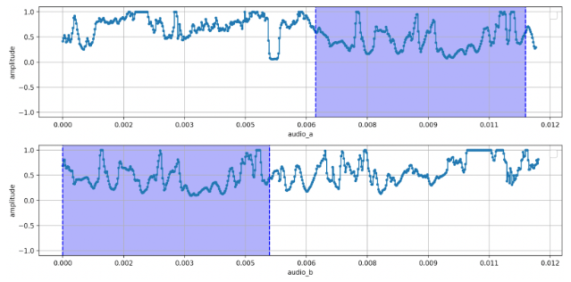
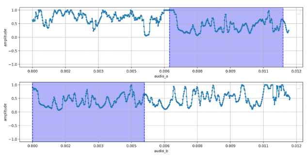
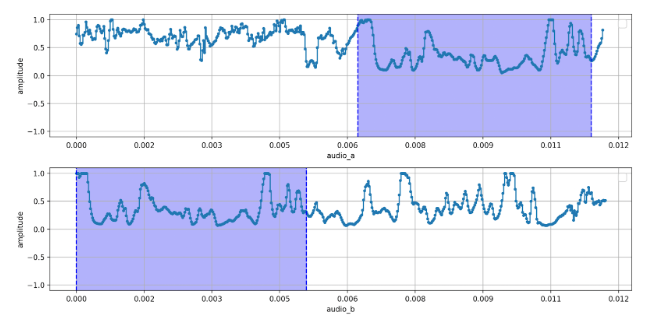
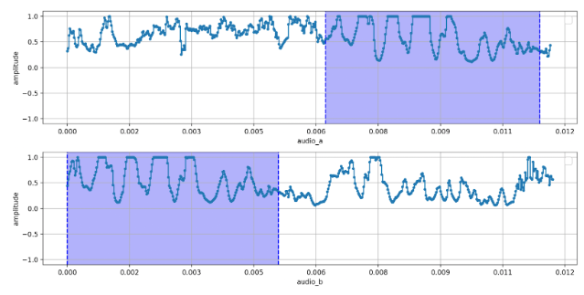
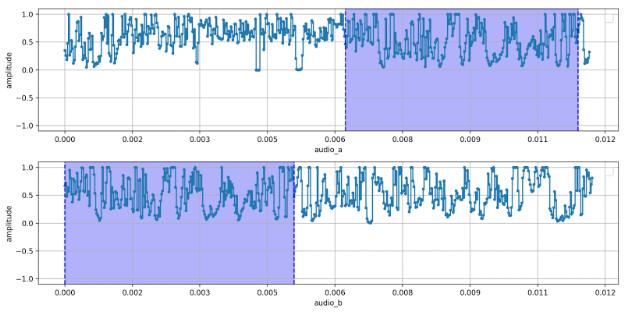
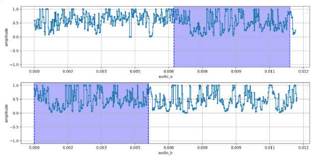
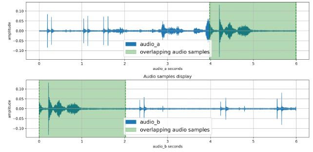
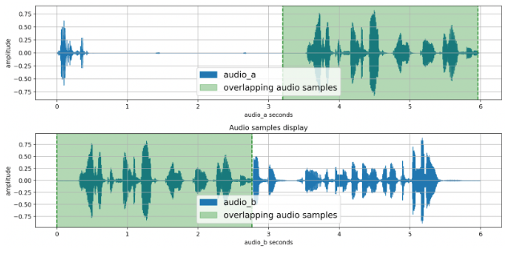
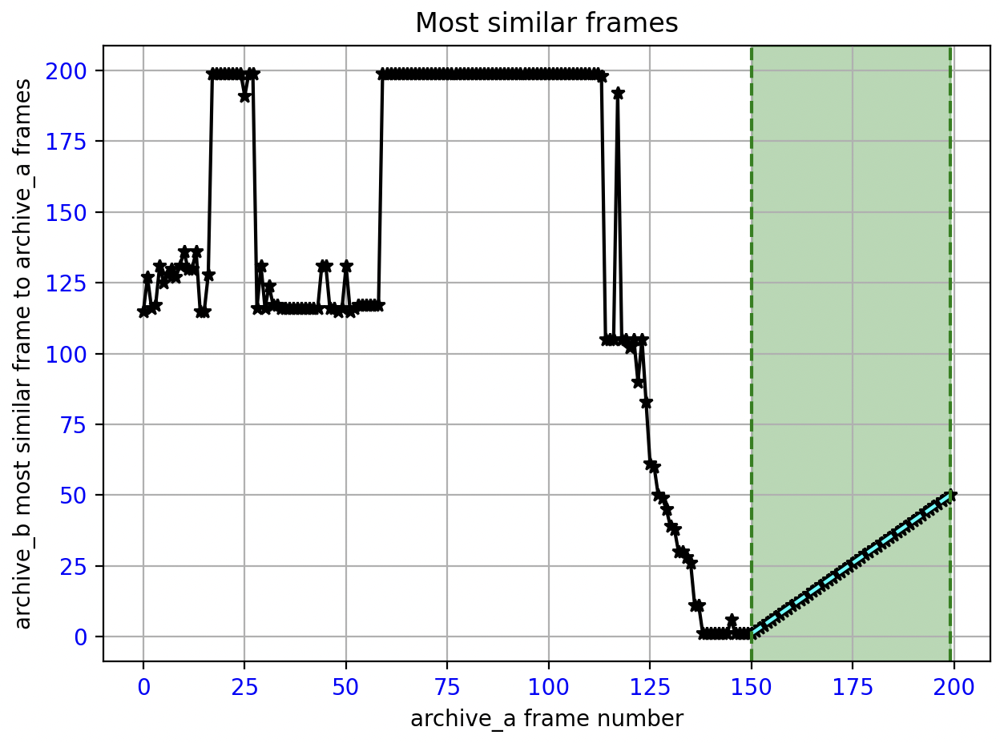

# Vonage Video Post Processing Composed Archives

**This tool merges pairs of consecutive composed archives created by the OpenTok auto-archiving capability. These
archives contain some media overlapping between the ending part of the first and the starting part of the second archive.**

After creating a serie of composed archives with the Vonage auto-archiving feature [[Vonage-automatic]], this tool can be used to merge them smoothy as possible, giving rise to longer archives that cover the whole session call. You can also use this tool with video recordings that are not created  as Vonage Video archives, as long as some media overlapping is present and the media configuration of all of the input archives satisfy the following criteria:

- **Composed Archive Audio/Video Params**
  - **Video**
    - codec: H264
    - profile: Constrained Baseline
    - pixel format: YUV 420p
    - level: 4.1
    - FPS: 25
    - PTS timescale: 90000
  - **Audio**
    - codec: AAC LC
    - sample rate: 48Khz
    - channels: 1
- **Container**
  - type: mp4

This readme file presents a brief explanation of how this piece of code determines the overlapping period between consecutive archives and how it merges the two archives.

## Overview

To minimize the encoding loss, the merging module searches for a video key frame within the estimated overlap. If one or more key frames exist, the code uses one of them to trim the end of the first archive and the start of the second archive before joining them. This process also allows the tool to stitch the media together with the least amount of transcoding possible. This maintains quality and reduces the computing cost of the process.

To discover the overlapping area, this tool only needs to analyze a small portion of both files, some seconds before the ending of the first archive and the beginning of the second.

Note please that to run the code, the __ffmpeg__ and __ffprobe__ software need to be installed in the user’s path.

## Content type

An archive might only contain audio, video or both. Regarding the overlapping content, the code evaluates each type of media independently.

## Algorithm

### Audio-only Archives

To assess when audio begins and ends to overlap in the first and consecutive archive, our audio algorithm extracts the chroma features of the original audio signals by applying the _Constant-Q Transform (CQT)_ [Brown, 1991]. This transform is a time-frequency analysis technique used to assess frequency content of a signal that changes over time. Although Short-Time Fourier Transform (STFT) is broadly utilized, we rely on the CQT as it logarithmically spaces the frequency bins, in addition to ensuring equal ratios of center frequency to bandwidth across all octaves. As the human auditory system perceives frequencies logarithmically, CQT is normally well suited for analysing musical signals and melodies, and for attempting to match human pitch perception.

The _chromas_ are composed into 12 bins or pitch classes of the Western chromatic scale octave, and at each time slice, the chroma vector represents the strength of each pitch class in the audio, with energy summed across all octaves.

Just below you will find the 4 chromas from two audio signals with some overlapping between the ending part of the first (upper-related representations) and the starting piece of the second audio (lower-related representation of each combo figure).

With a quick glance at the blue areas, it can be appreciated the high similarity between both chroma signals. Figures for the rest of the 8 chromas are not included for the shake of conciseness, but they present the same similarity trends.

Only for illustrative purposes, we would like to show you the first two chromas from the same audio signals but instead of using the logarithmic CQT, a linear STFT is applied.

As it can be noticed, similarities are still there but are harder to perceptually and computationally be found. 

It is worth mentioning that the audio library chosen to pursue our audio assessment is _librosa_ [McFee et al., 2015]. Once the 12 chromas are extracted per audio signal, a sliding window with a fixed size is used to partition the chromas and extract the *linear Pearson correlation* [Stanton, 2001] coefficients. Notice here that this computation is conducted iteratively by moving the window along both original audio’s chroma signals. Sequentially, and to estimate the temporal overlapping information, the tool calculates the similarity between the 12 correlation outcomes and filters the resulting values together with each corresponding maximum correlation. 

Just below, you will find render some results from 3 pairs of different audio signals, where the green area corresponds to the audio overlapping samples:

As it is clearly visible at first glance, our audio algorithm is capable of finding out the parts of both audios that are redundant. 

We provide two different solutions according to the number of iterations carried out during the sliding window computation of the algorithm: 

- **Deep-search**: this option can be executed if -s or --deep-search is added to the running command.
- **Partial-search**: default algorithm.

### Video-only Archives: 

For analysing the video frames overlapping, four different metrics have been implemented: __MSE__, __UNILBP__, __VARLBP__ and __WAVELET__. Each of them are based upon the idea that the minimum value these algorithms return, the higher the similarity is between frames from both videos. Similar to audio, the code slides frame to frame the second video portion, which corresponds to the last number of seconds specified by the user as assessment period, over each frame of the first selected video piece. After executing some minor computation to the frames’ gradients, it calculates the metrics:

- **MSE**:
    * **Mean Squared Error** is applied to quantify the average of the squares of the errors or, in our case, the differences between two frames. This algorithm does not account for perceptual similarities. However, it is sensitive to large outliers and only considers the number of gradients that are not flattened. As we are not interested in the structural differences, MSE results in delivering a very satisfactory performance. To show an example of how graphically Archive-Stitcher renders the results, we facilitate here a graphical outcome:
                    

      where the green area depicts the frames highest similarity relationship of the first and second archives where the overlapping takes place, being the frame 1 of the second archive the most similar to the frame 50 of the first archive, frame 2 with frame 51, and so on, respectively. The 45 degrees line clearly reflects that their most similar frames are consecutively ordered, respectively.

      It is obvious that this correlation is later converted to timing data to obtain the overlapping period for video.

- **UNILBP**: 
    * **Local Binary Pattern (LBP) - uniform** is a simple but powerful texture descriptor widely used in image processing. It is specially used to detect texture information as it compares each pixel with its neighborhood to provide a binary pattern that will be considered as a LBP code for the pixel [Ojala et al., 1994]. When employing the **uniform method**, only two transitions are taken into account: from 0 to 1 and from 1 to 0, e.g., 00000000, 11111111, 00011100. It is used to reduce dimensionality. From our use-case, we sum the filtered patterns and filter the final value. To implement this solution our tool relies on the scikit-image image processing library in python [Van der Walt et al., 2014].

- **VARLBP**:
    * **Local Binary Pattern (LBP) - variance** is an extension of the traditional LBP that incorporates variance (or equivalently, local contrast) information to improve texture representation, especially under illumination changes. This **variance-based method** complements the previous described LBP architecture by adding local variance data to quantify the contrast changes within each gradient. For our use case, it might be more robust than its predecessor when the media content is more static at the cost of computational complexity and execution time.

- **WAVELET**:
    * **Haar Wavelet** was firstly introduced by Hungarian mathematician Alfréd Haar in 1909. It is utilized to average and differentiate adjacent values. The 2D transform results in four subbands: __LL__ (low-pass in both directions), __HL__ (low-pass rows, high-pass columns), __HL__ (high-pass rows, low-pass columns) and __HH__ (high-pass in both directions). Most of the image's energy is in the LL band while the corner details are represented in the rest of the subbands. It is because of this that our tool sums the filtered HL, LH and HH frequency details and discards the LL band information. To implement this solution we have used the PyWavelets python package [Lee et al., 2019].

Please note that some framewise pre-processing is always applied before computing any of our four algorithms.

### Audio+Video Archives

In the case of having archives with both audio and video, our tool finds separately the overlapping period for each of them. Next, it evaluates the intersection and makes different decisions according to: a) if the intersection is null; b) if the audio and video intersections are not similar enough; and c) when both overlaps are very similar. For a) and b) audio overlap data is prioritized as audio information is usually more legitimate for cases in which the video data might present a highly static trend. Finally, for the c) situation both overlapping periods are passed to the merge mechanism in which each, audio and video intervals, is used when merging each media track. 

## Other useful material

Our developer documentation [[Vonage-post-processing]] contains easy to understand explanations and ready to use code. Please refer to https://github.com/opentok/archive-post-processing/blob/main/examples/archive-stitcher/README.md for an extend documetation about how to run the tool.

---

## References 
- [Brown, 1991] Judith C. Brown, "Calculation of a constant Q spectral transform." *The Journal of the Acoustical Society of America*, 89(1), pp. 425–434. January 1991. DOI: [DOI](https://doi.org/10.1121/1.400476)

- [Lee et al., 2019] Gregory R. Lee, Ralf Gommers, Filip Wasilewski, Kai Wohlfahrt, Aaron O’Leary, "PyWavelets: A Python package for wavelet analysis." *Journal of Open Source Software*, 4(36), 1237. 2019. DOI: [DOI](https://doi.org/10.21105/joss.01237). Link: [pywavelets](https://pywavelets.readthedocs.io/en/latest/)

- [McFee et al., 2015] McFee, Brian, Colin Raffel, Dawen Liang, Daniel PW Ellis, Matt McVicar, Eric Battenberg, and Oriol Nieto. "librosa: Audio and music signal analysis in python." *In Proceedings of the 14th python in science conference*, pp. 18-25. 2015. Link: [librosa](https://librosa.org/doc/latest/index.html)

- [Ojala et al., 1994] T. Ojala, M. Pietikäinen, and D. Harwood, "Performance evaluation of texture measures with classification based on Kullback discrimination of distributions." *Proceedings of the 12th IAPR International Conference on Pattern Recognition (ICPR 1994)*, vol. 1, pp. 582 - 585. October 1994. ISBN: 0-8186-6265-4. DOI: [DOI](https://doi.org/10.1109/ICPR.1994.576366)

- [Stanton, 2001] Jeffrey M. Stanton, "Galton, Pearson, and the Peas: A Brief History of Linear Regression for Statistics Instructors." *In American Statistical Association*, vol. 9, issue 3. 2001. ISSN: 1069-1898. DOI: [DOI](https://doi.org/10.1080/10691898.2001.11910537)

- [Van der Walt et al., 2014] Stéfan van der Walt, Johannes L. Schönberger, Juan Nunez-Iglesias, François Boulogne, Joshua D. Warner, Neil Yager, Emmanuelle Gouillart, Tony Yu and the scikit-image contributors. "Scikit-image: Image processing in Python". *PeerJ* 2:e453. 2014. DOI: [DOI](https://doi.org/10.7717/peerj.453). Link: [scikit-image](https://scikit-image.org/docs/0.25.x/auto_examples/features_detection/plot_local_binary_pattern.html)

[Vonage-automatic]: https://developer.vonage.com/en/video/guides/archiving/overview#automatically-archived-recording-sessions "Vonage property, Archiving. Vonage Video API archiving lets you record, save and retrieve sessions."

- \[Vonage-automatic\]\: https://developer.vonage.com/en/video/guides/archiving/overview#automatically-archived-recording-sessions "Vonage property, Archiving. Vonage Video API archiving lets you record, save and retrieve sessions."

[Vonage-post-processing]: https://developer.vonage.com/en/video/guides/archiving/overview#post-processing-composed-archives "Vonage property, Archiving. Vonage Video API archiving lets you record, save and retrieve sessions."

- \[Vonage-post-processing\]\: https://developer.vonage.com/en/video/guides/archiving/overview#post-processing-composed-archives "Vonage property, Archiving. Vonage Video API archiving lets you record, save and retrieve sessions."
